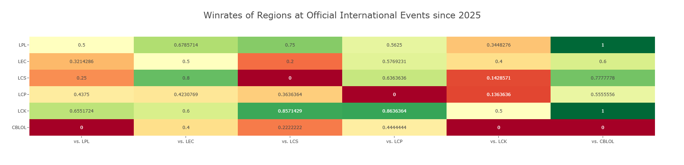
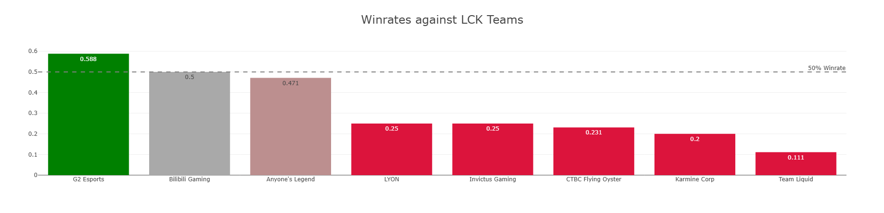
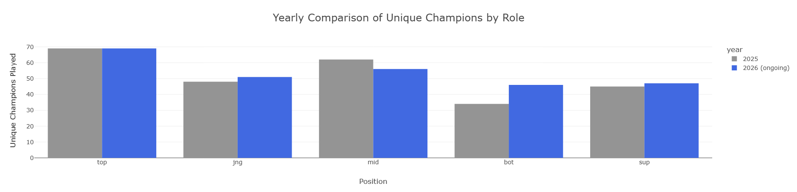
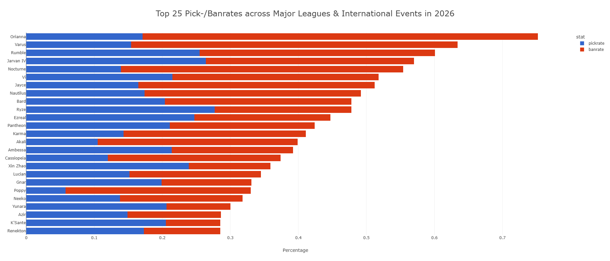

# OVERVIEW

This project analyses the following League of Legends Esports data:
1. Team and Region performance at official international events
2. Basic Player Performance at international events
3. Champion and Game Meta analysis

# KEY INSIGHTS

- South Korea (LCK) is the only region to have a positive win rate against every other region.
- North American Teams have a staggering 80% win rate against European Teams since the beginning of 2025.
---

- G2 Esports has the highest win rate against Korean Teams this year at 58.82%.
- No other team has a positive winrate, with most having very low winrates.
---

- Most lanes already have more unique Champions picked this year than in the entire last season.
- Botlane has seen the largest increase at 35%.
---

- Orianna has been picked or banned in 75% of games in major leagues this year.

# DATA PIPELINE

1. **Data Ingestion & Cleaning:** Filtered raw match records, normalized and corrected attribute values, created tables.
2. **Export:** Generated parquet files for faster querying and easier shareability.
3. **Analysis:** Executed SQL Queries to provide insights on the data.
4. **Visualization:** Created Bar Charts for Key Insights through Plotly Express.

# TECH STACK

* **Language:** Python
* **Libraries:** Duck DB
* **Environment:** Jupyter Notebooks

# HOW TO REPRODUCE

This repository includes two execution paths depending on your desired actions.

## Full Reproduction

These steps are necessary to reproduce the steps in Data Ingestion and Data Transformation notebooks.

1. Download the raw .csv files for the 2025 and 2026 season at: and place them in the data/raw/ directory. These files are roughly 150mb combined and can be downloaded at https://oracleselixir.com/tools/downloads
2. Execute the Jupyter Notebook 01_data_preparation.ipynb from top to bottom

## Analysis only

To execute the Data Analysis notebook, no extra steps are required. The repository contains the necessary player_data.parquet and team_data.parquet files.

1. Open 02_Data_Analysis.ipynb and execute from top to bottom.

# DATA SOURCE
Data provided by [Oracle's Elixir](https://oracleselixir.com/tools/downloads). 